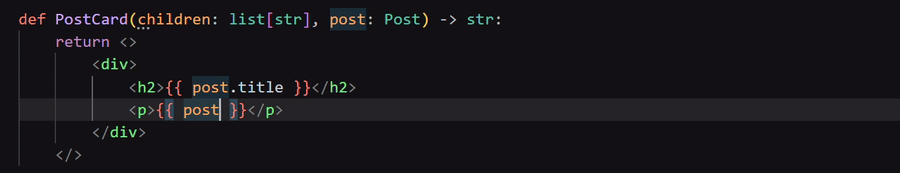

# Language Server

Type checking, completions, hover docs, go-to-definition, and rename work out of the box.




## Features

- **Diagnostics** — type errors and undefined names reported inline
- **Hover** — type information and docstrings on hover
- **Completions** — attribute, method, and name completions including trigger-on-dot
- **Semantic tokens** — type-aware syntax highlighting for Python code inside fragments
- **Syntax highlighting** — structural highlighting for `<>`, tags, and `{{ }}` interpolations
- **Go-to-definition** — jump to the definition of a symbol
- **Rename** — rename a symbol across all files in the workspace

Not yet implemented:

- **Find references** — list all usages of a symbol
- **Fragments-specific syntax** — autocompletion and syntax highlighting for fragments blocks

## Installation

```bash
pip install python-fragments[lsp]
```

Then start the language server:

```bash
fragments-lsp
```
